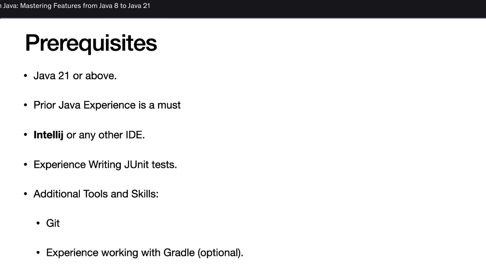

The image shows the **Prerequisites** for a Java course focused on mastering features from Java 8 to Java 21. Below is a detailed breakdown of the content:

---

### **Prerequisites**
1. **Java Version Requirement:**
   - **Java 21 or above:** Participants must have access to and familiarity with Java 21 or a newer version. This ensures compatibility with the latest features covered in the course.

2. **Prior Java Experience:**
   - **Prior Java Experience is a must:** The course assumes that learners already have foundational knowledge of Java programming. This includes understanding basic concepts such as:
     - Syntax (e.g., variables, control structures, classes, methods).
     - Object-oriented programming principles.
     - Familiarity with core libraries and APIs.

3. **Integrated Development Environment (IDE):**
   - **IntelliJ or any other IDE:** Learners should be comfortable using an IDE like IntelliJ IDEA or another popular Java development environment (e.g., Eclipse, NetBeans). An IDE is essential for writing, debugging, and running Java code efficiently.

4. **JUnit Testing Experience:**
   - **Experience Writing JUnit Tests:** Participants should have prior experience with JUnit, a widely used testing framework for Java. This skill is crucial for writing unit tests, which are often part of modern software development practices.

5. **Additional Tools and Skills:**
   - **Git:** Familiarity with Git is required. Git is a version control system used for managing source code changes, collaborating with others, and maintaining code repositories. Knowledge of basic Git commands (e.g., `git clone`, `git commit`, `git push`) is expected.
   - **Gradle (optional):** Experience working with Gradle is optional but beneficial. Gradle is a build automation tool commonly used in Java projects to manage dependencies, compile code, and run tests. While not mandatory, familiarity with Gradle can enhance the learning experience.

---

### **Summary**
- **Core Requirements:**
  - Java 21 or higher.
  - Prior Java programming experience.
  - Proficiency with an IDE (e.g., IntelliJ).
  - Experience with JUnit testing.
  - Basic Git skills.

- **Optional Skill:**
  - Familiarity with Gradle.

This set of prerequisites ensures that learners have the necessary foundation to engage effectively with the course material, which focuses on advanced Java features from Java 8 to Java 21.
