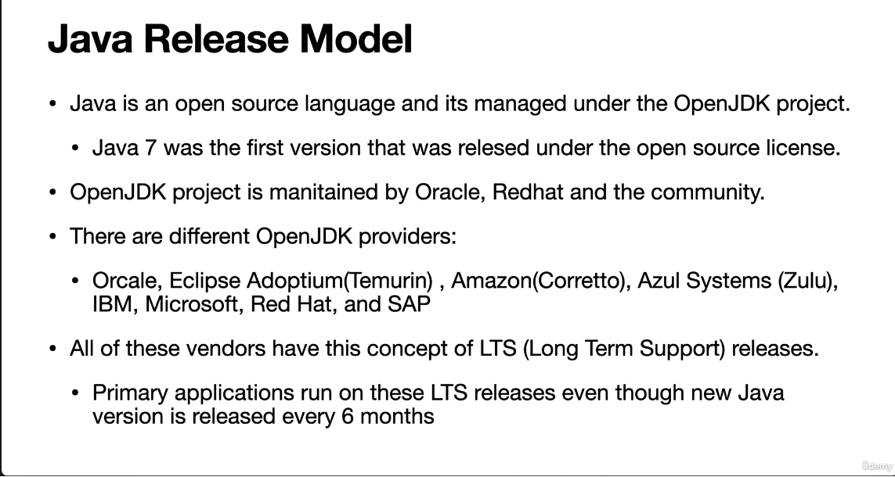

The image outlines the **Java Release Model**, highlighting key aspects of how Java is managed, released, and supported. Below is a detailed breakdown of the content:

---

### **Java Release Model**
1. **Open Source Nature of Java:**
   - **Java is an open-source language:** Java is developed and maintained as an open-source project.
   - **Managed under the OpenJDK project:** The OpenJDK (Open Java Development Kit) is the reference implementation of the Java platform and serves as the foundation for all Java releases.

2. **Historical Context:**
   - **Java 7 was the first version released under the open-source license:** Prior to Java 7, Java was primarily proprietary. With Java 7, Oracle transitioned Java to an open-source model, making it more accessible and collaborative.

3. **Maintenance of OpenJDK:**
   - **Maintained by Oracle, Red Hat, and the community:** The OpenJDK project is not solely managed by Oracle. It involves contributions from major organizations like Red Hat and the broader developer community, ensuring diverse input and collaboration.

4. **OpenJDK Providers:**
   - There are multiple providers of OpenJDK implementations, each offering their own distributions and support models. Some notable providers include:
     - **Oracle**
     - **Eclipse Adoptium (Temurin)**: A community-driven distribution of OpenJDK.
     - **Amazon (Corretto)**: Amazon's OpenJDK distribution.
     - **Azul Systems (Zulu)**: Azul's OpenJDK distribution.
     - **IBM**
     - **Microsoft**
     - **Red Hat**
     - **SAP**

5. **Long-Term Support (LTS):**
   - **All vendors offer LTS releases:** Despite the six-month release cycle for new Java versions, most vendors provide Long-Term Support (LTS) releases. These LTS versions are stable, well-tested, and receive extended maintenance and security updates.
   - **Primary applications run on LTS releases:** Even though new Java versions are released every six months, most production environments rely on LTS releases due to their stability and long-term support.

---

### **Key Takeaways**
- **Open Source:** Java is open-source and managed under the OpenJDK project.
- **Community Collaboration:** The OpenJDK project is maintained by Oracle, Red Hat, and the broader community.
- **Diverse Providers:** Multiple organizations provide OpenJDK distributions, including Oracle, Eclipse Adoptium, Amazon, Azul, IBM, Microsoft, Red Hat, and SAP.
- **LTS Releases:** Vendors offer Long-Term Support (LTS) releases, which are critical for enterprise applications that require stability and extended support.

This model ensures that Java remains flexible, innovative, and widely adopted across various platforms and use cases.