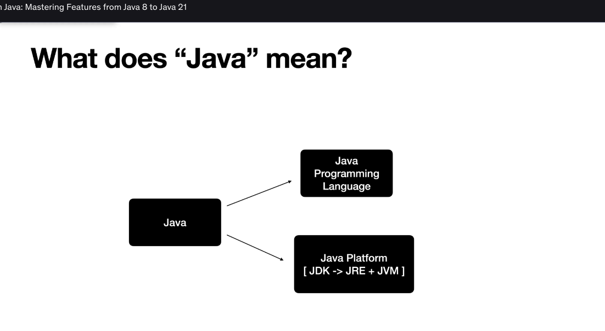
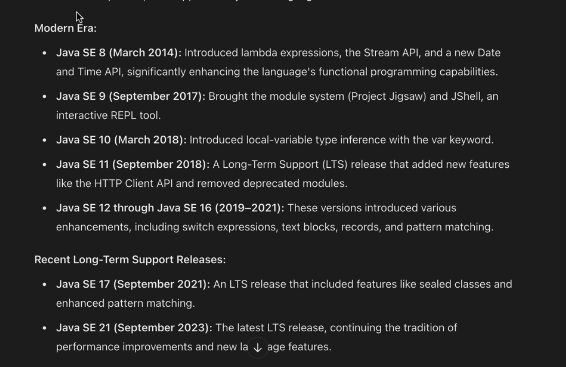
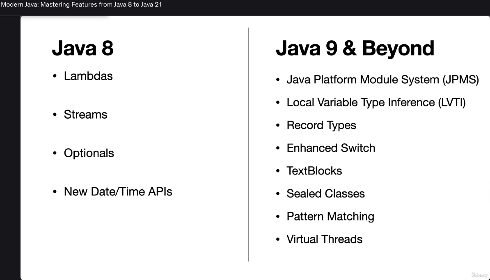

The image outlines the **Evolution of Java = Modern Java**, highlighting key milestones and features introduced in recent versions of Java. Below is a detailed breakdown of the content:

---

### **Title: Evolution of Java = Modern Java**
This section emphasizes how Java has evolved over time, particularly focusing on modern features introduced since Java 8.

---

### **Key Points Covered:**

1. **Functional Programming (Java 8)**
   - Java 8 marked a significant shift towards functional programming paradigms.
   - Key features include:
     - **Lambdas:** A concise way to represent anonymous functions, enabling more expressive and readable code.
     - **Streams:** A powerful API for processing collections of data in a declarative and functional style. Streams allow operations like filtering, mapping, reducing, and more.
     - **CompletableFuture:** A utility class that provides support for asynchronous programming with a functional approach. It helps manage tasks that may complete at some point in the future.

2. **Release of Java Modules (Java 9)**
   - Java 9 introduced the **Java Platform Module System (JPMS)**, which brought modularity to the Java platform.
   - Key aspects include:
     - **Modularization of the Java Runtime Libraries:** The core libraries of the Java runtime were reorganized into modules, allowing better encapsulation and control over dependencies.
     - This change aimed to improve security, maintainability, and scalability of large-scale applications.

3. **Six-Month Release Cycle (Java 10 onwards)**
   - Starting with Java 10, Oracle adopted a new release cadence: **a six-month release cycle**.
   - This means that new versions of Java are released every six months, ensuring that developers have access to the latest features and improvements more frequently.
   - Key implications:
     - Faster innovation and adoption of new features.
     - Shorter development cycles for new releases.
     - Enhanced focus on continuous improvement and responsiveness to community feedback.

4. **Release New Features Every 6 Months**
   - As part of the six-month release cycle, each new version of Java introduces new features and enhancements.
   - This regular release schedule ensures that Java remains competitive and relevant in the rapidly evolving software landscape.

---

### **Summary**
- **Java 8:** Introduced functional programming concepts such as Lambdas, Streams, and CompletableFuture.
- **Java 9:** Brought modularity to the Java platform through the Java Platform Module System (JPMS), modularizing the Java Runtime Libraries.
- **Java 10 onwards:** Adopted a six-month release cycle, leading to more frequent updates and the introduction of new features every six months.

This evolution reflects Java's commitment to staying modern, innovative, and responsive to the needs of developers and the industry.

Here's the comparison between **Java 8** and **Java 9 & Beyond** in **table format**, summarizing the key features introduced in each version:

| **Feature / Version**        | **Java 8**                                                                 | **Java 9 & Beyond**                                                                                     |
|-----------------------------|----------------------------------------------------------------------------|--------------------------------------------------------------------------------------------------------|
| **Lambdas**                 | ✅ Introduced                                                              | ❌ Not new, but usable                                                                                 |
| **Streams API**             | ✅ Introduced                                                              | ❌ Already available                                                                                    |
| **Optional Class**          | ✅ Introduced                                                              | ❌ Already available                                                                                    |
| **New Date/Time API**       | ✅ `java.time` package introduced                                          | ❌ Already available                                                                                    |
| **Module System (JPMS)**    | ❌ Not available                                                           | ✅ Introduced in Java 9                                                                                 |
| **Local Variable Type Inference (`var`)** | ❌ Not available                                                   | ✅ Introduced in Java 10                                                                                |
| **Record Types**            | ❌ Not available                                                           | ✅ Introduced in Java 16                                                                                |
| **Enhanced Switch Expressions** | ❌ Not available                                                       | ✅ Introduced and enhanced from Java 12 onward                                                          |
| **TextBlocks (`"""`) **     | ❌ Not available                                                           | ✅ Introduced in Java 15                                                                                |
| **Sealed Classes**          | ❌ Not available                                                           | ✅ Introduced in Java 17                                                                                |
| **Pattern Matching**        | ❌ Not available                                                           | ✅ Enhanced starting from Java 14                                                                       |
| **Virtual Threads**         | ❌ Not available                                                           | ✅ Introduced in Java 21 (Preview)                                                                      |

---

### ✅ Key Highlights:
- **Java 8** laid the foundation for modern Java with functional programming and APIs.
- **Java 9 and beyond** focused on **modularity**, **conciseness**, **expressiveness**, and **performance improvements** like **virtual threads**.

Let me know if you'd like this exported as a CSV or Markdown file!

