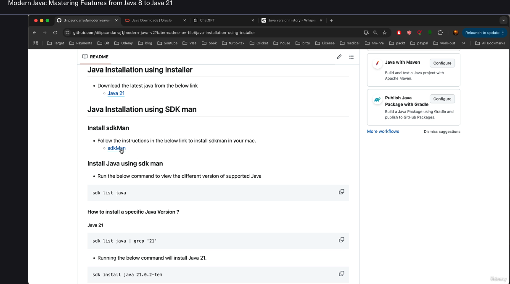
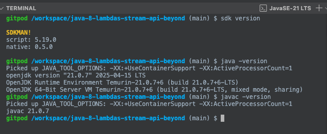

https://sdkman.io/

SDK Man is similar to nvm in node js which allow to set the require java version in the current environment

sdk list
sdk install java
sdk current

sdk version
java -version
javac -version

