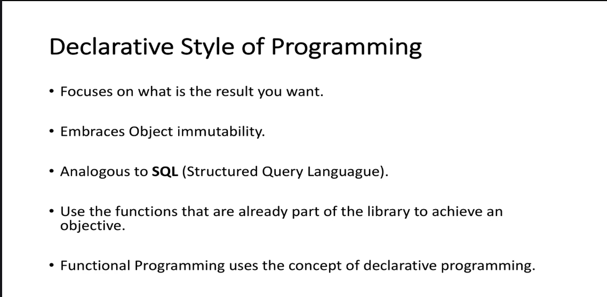

The image provides an overview of the **Declarative Style of Programming**. Below is a detailed breakdown of the content:

---

### **Declarative Style of Programming**
1. **Focus on What Is the Result You Want:**
   - Declarative programming emphasizes **what** you want to achieve rather than **how** to achieve it.
   - Instead of specifying step-by-step instructions, declarative code describes the desired outcome or behavior.

2. **Embraces Object Immutability:**
   - In declarative programming, objects are typically **immutable**, meaning their state cannot be changed once created.
   - This approach reduces side effects and makes programs more predictable and easier to reason about.

3. **Analogous to SQL (Structured Query Language):**
   - SQL is a classic example of declarative programming. When writing SQL queries, you specify what data you want to retrieve or manipulate without detailing how the database should execute the query.
   - For example:
     ```sql
     SELECT * FROM users WHERE age > 30;
     ```
     Here, the query specifies the desired result (all users older than 30) without dictating the steps the database engine should take to fetch the data.

4. **Use the Functions That Are Already Part of the Library to Achieve an Objective:**
   - Declarative programming leverages existing functions or libraries to build solutions.
   - Developers focus on combining these functions in a way that produces the desired output, rather than writing low-level implementation details.

5. **Functional Programming Uses the Concept of Declarative Programming:**
   - Functional programming is a paradigm that heavily relies on declarative principles.
   - Key features of functional programming, such as pure functions, higher-order functions, and immutability, align with the declarative style.
   - For example, in functional programming, you might use map, filter, and reduce operations to process collections, focusing on the transformation logic rather than the iteration mechanism.

---

### **Key Characteristics of Declarative Programming:**
- **What Over How:** Focuses on describing the desired outcome rather than the steps to achieve it.
- **Immutability:** Emphasizes immutable data structures to avoid side effects.
- **Abstraction:** Leverages high-level abstractions and existing functions/libraries.
- **Readability and Maintainability:** Code is often more concise and easier to understand because it focuses on intent rather than implementation details.

---

### **Example in Java (Declarative Style Using Streams):**
```java
import java.util.Arrays;
import java.util.List;

public class DeclarativeExample {
    public static void main(String[] args) {
        // List of numbers
        List<Integer> numbers = Arrays.asList(1, 2, 3, 4, 5);
        
        // Calculate the sum using streams (declarative)
        int sum = numbers.stream()
                         .filter(n -> n % 2 == 0) // Filter even numbers
                         .mapToInt(n -> n * 2)    // Double each number
                         .sum();                  // Sum the results
        
        // Print the result
        System.out.println("Sum: " + sum);
    }
}
```
- **Explanation:**
  - The code uses Java Streams to describe the desired operations (filtering, mapping, and summing) without explicitly iterating through the list.
  - Each step (`filter`, `map`, `sum`) is a high-level operation that focuses on what needs to be done, not how it is implemented.

---

### **Summary**
- **Declarative programming** focuses on **what** you want to achieve, using immutable objects and leveraging existing library functions.
- It is analogous to SQL and is a core concept in functional programming.
- This style promotes readability, maintainability, and reduces complexity by abstracting away low-level implementation details.