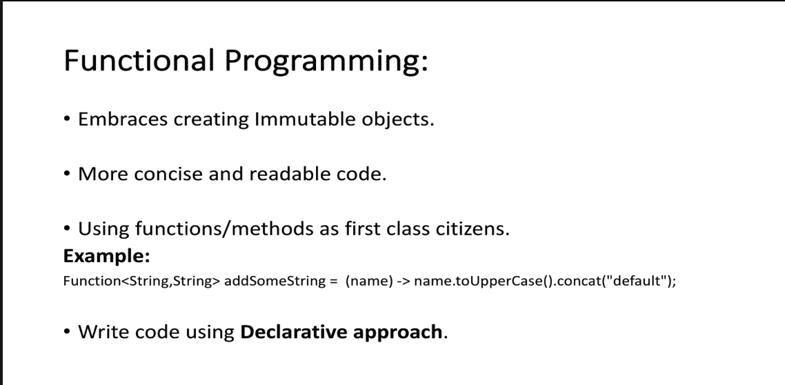
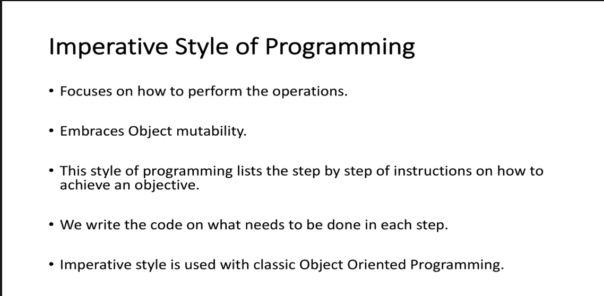
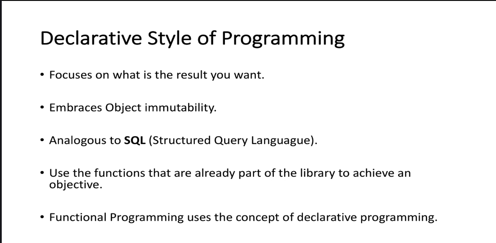

The image provides a concise explanation of **why Java 8 is significant**. Below is a detailed breakdown of the content:

---

### **Why Java 8?**
1. **Most Popular and Widely Accepted Language in the World:**
   - Java 8 was released at a time when Java was already one of the most popular and widely used programming languages globally.
   - Its widespread adoption made it a critical platform for enterprise applications, web development, mobile app development (via Android), and more.

2. **Introduction of Functional Features:**
   - The creators of Java recognized the growing demand for functional programming paradigms, which allow developers to write more concise, expressive, and maintainable code.
   - Key functional features introduced in Java 8 include:
     - **Lambdas:** Allow anonymous functions to be passed as arguments, enabling functional-style programming.
     - **Streams:** Provide a way to process collections of data in a declarative and functional manner, supporting operations like filtering, mapping, reducing, and more.
     - **Optional:** A container object that may or may not contain a value, helping to avoid `null` pointer exceptions and improve code robustness.
     - **Other Functional Features:** Additional enhancements like method references and improved type inference.

3. **Technological Advancements with Mobile/Laptops/Systems:**
   - Java 8 was released during a period of rapid technological advancement, particularly in mobile devices, laptops, and computing systems.
   - These advancements required Java to evolve to support modern use cases, such as big data processing, cloud computing, and high-performance applications.

4. **Simplified Concurrency Operations:**
   - Java 8 introduced several improvements to simplify concurrency and parallelism:
     - **CompletableFuture:** A utility class for asynchronous programming with a functional approach, allowing better management of tasks that may complete in the future.
     - Enhanced support for parallel streams, which automatically leverage multi-core processors for faster data processing.

---

### **Key Takeaways:**
- **Popularity:** Java 8 built upon Java's existing popularity, making it even more widely adopted.
- **Functional Programming:** Java 8 introduced key functional features (e.g., Lambdas, Streams, Optional) to keep up with modern programming trends.
- **Technological Context:** The release aligned with advancements in technology, particularly in mobile and cloud computing.
- **Concurrency Improvements:** Simplified concurrency operations to handle modern, high-performance applications more effectively.

Java 8 marked a significant milestone in Java's evolution, bridging the gap between traditional object-oriented programming and functional programming paradigms. This made Java more versatile and powerful for a wide range of applications.

