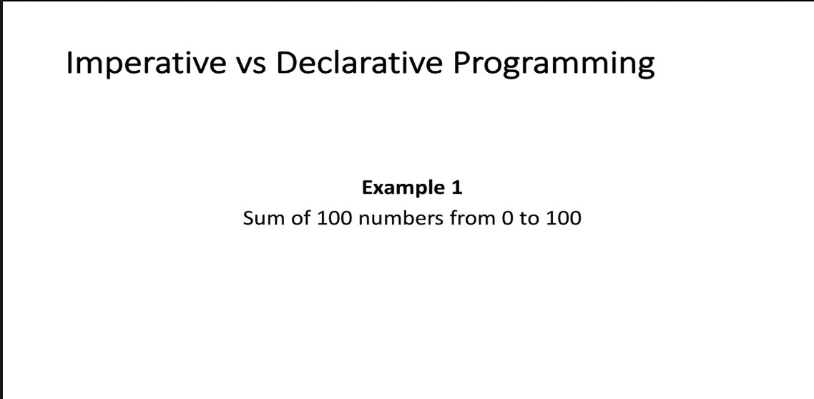

The image introduces a comparison between **Imperative Programming** and **Declarative Programming** using an example. Below is a detailed breakdown of the content:

---

### **Title: Imperative vs Declarative Programming**
This section sets the context for comparing two programming paradigms:
- **Imperative Programming:** Focuses on how to perform operations step-by-step.
- **Declarative Programming:** Focuses on what the desired outcome is, without specifying the exact steps.

---

### **Example 1: Sum of 100 Numbers from 0 to 100**
This example will be used to illustrate the differences between imperative and declarative approaches. The task is to calculate the sum of numbers from 0 to 100.

---

### **Expected Comparison**
Although the image does not provide the actual code examples, here is how the comparison might look based on the title and example:

#### **Imperative Approach (Step-by-Step Instructions)**
In imperative programming, you explicitly write the steps to achieve the result. For the given example, the code might look like this:

```java
int sum = 0;
for (int i = 0; i <= 100; i++) {
    sum += i;
}
System.out.println("Sum: " + sum);
```

- **Key Characteristics:**
  - Uses a loop (`for`) to iterate through each number.
  - Explicitly updates the `sum` variable in each iteration.
  - Focuses on **how** to compute the sum.

#### **Declarative Approach (Describe the Outcome)**
In declarative programming, you describe the desired outcome without specifying the exact steps. Using Java Streams (a declarative feature), the code might look like this:

```java
int sum = IntStream.rangeClosed(0, 100).sum();
System.out.println("Sum: " + sum);
```

- **Key Characteristics:**
  - Uses `IntStream.rangeClosed` to generate a stream of numbers from 0 to 100.
  - Applies the `sum()` method to compute the total.
  - Focuses on **what** the desired result is (the sum of numbers from 0 to 100).

---

### **Summary**
- **Imperative Programming:** Involves explicit, step-by-step instructions to achieve the result.
- **Declarative Programming:** Describes the desired outcome and relies on built-in functions or libraries to handle the implementation details.

The example of calculating the sum of numbers from 0 to 100 serves as a clear illustration of these differences.