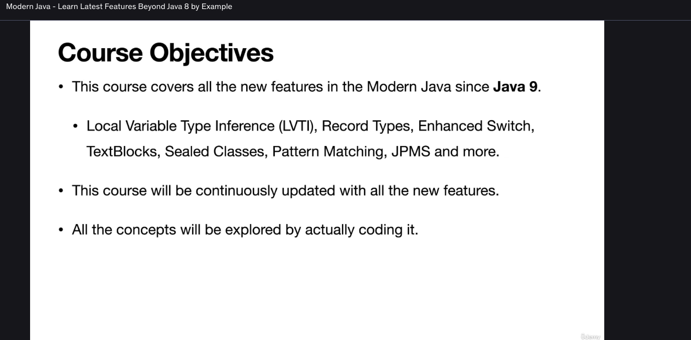

Learn all Java features from Java 8 to Java 21 such as TextBlocks,Records,Sealed Classes, Pattern Matching by coding it.

3 hours
All the new features in Modern Java
LVTI, TextBlocks, Enhanced Switch, Record Classes
Use Sealed Class to apply controlled Inheritance
Learn Pattern Matching to write concise and structured code
Java Platform Module System(JPMS) and its benefits
Student will be able to upgrade their Java knowledge to the latest Java Features

The image shows the course objectives for a Java course focused on modern features beyond Java 8. Here is a detailed breakdown of the content:

### **Course Objectives**
1. **Coverage of Modern Java Features:**
   - The course covers all the new features in Modern Java since Java 9.
   - Specific features mentioned include:
     - **Local Variable Type Inference (LVTI):** Allows developers to use `var` instead of explicitly specifying the type of a local variable.
     - **Record Types:** A concise way to define classes that are logically data carriers, with minimal boilerplate code.
     - **Enhanced Switch:** Provides more powerful and flexible switch statements, including pattern matching support.
     - **TextBlocks:** Simplifies the creation of multi-line string literals by using triple quotes (`"""`).
     - **Sealed Classes:** Introduces sealed types to control which classes can extend or implement a given class or interface.
     - **Pattern Matching:** Enhances the ability to match patterns in switch statements and other contexts.
     - **JPMS (Java Platform Module System):** Manages dependencies and encapsulation in large-scale applications.

2. **Continuous Updates:**
   - The course will be continuously updated to include all new features as they are released in future versions of Java.

3. **Hands-On Learning:**
   - All concepts will be explored through actual coding exercises, ensuring practical application and understanding of the features.

### **Summary**
This course aims to provide a comprehensive understanding of the latest features in Modern Java, starting from Java 9 onwards. It emphasizes practical learning through coding and ensures that the content remains up-to-date with the evolving Java ecosystem. The inclusion of specific features like Local Variable Type Inference, Record Types, Enhanced Switch, TextBlocks, Sealed Classes, Pattern Matching, and JPMS highlights the course's focus on modern programming practices and tools.